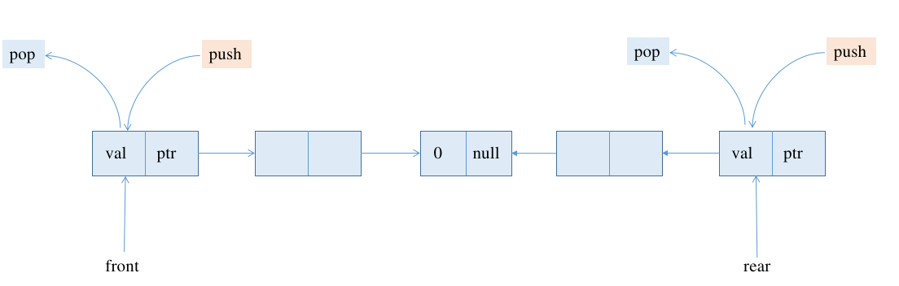
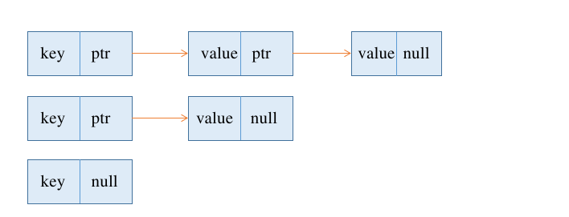

### 基本介绍
本项目名为`tinydsaa`,即 `tiny data struct and algorithm`。基本目的在于用c语言从0开始实现一个小的数据结构与基本算法集合。同时因为是学习使用，测试数据并不能涵盖所有情况，所以难免存在一些代码结构冗余或者部分代码存在bug的情况。因此，若发现本人有任何的代码错误或者代码有优化的空间，还望指正。

### 主要包括以下几个方面的内容
- [x] 顺序表
- [x] 单链表
- [x] 循环链表
- [x] 双链表
- [x] 链栈
- [x] 顺序栈
- [x] 链队列
- [x] 循环队列
- [x] 双端队列
- [ ] 集合
- [x] 散列表
- [x] 二叉排序树
- [x] 二叉线索树
- [x] 二叉平衡树
- [x] 完全二叉树
- [ ] B+树
- [ ] 红黑树
- [x] 大顶堆
- [x] 小顶堆
- [x] 图(邻接表，邻接矩阵)
- [x] 二分查找
- [x] 排序(冒泡，插入，选择，归并，希尔)

### 基本结构定义与介绍
#### 顺序表


```c
typedef struct
{
  ElementType *base;
  int max_size;
  int cur_len;
} dynamic_sqlist_t;

```

#### 单链表


```c
typedef struct linkNode
{
    ElementType data;
    struct linkNode *next;
} linkNode_t, *ptr_linkedList;
```
#### 循环链表


```c
struct CycLNode
{
  ElementType data;
  struct CycLNode *next;
};

```

#### 双链表


```c
typedef struct doubleLinkNode
{
  ElementType data;
  struct doubleLinkNode *pre;
  struct doubleLinkNode *next;
} doublelinkNode_t, *ptr_double_linkedList;
```

#### 链栈


```c
typedef struct StackNode
{
  ElementType data;
  struct StackNode *next;
} StackNode_t;

typedef struct linkedListStack
{
  StackNode_t *top;
  int size;
} linkedListStack_t;
```

#### 顺序栈


```c
typedef struct Stack
{
  ElementType *base;
  ElementType *top;
  int stack_size;
} SqStack;
```

#### 链队列


```c
typedef struct QueueNode
{
  ElementType data;
  struct QueueNode *next;
} QueueNode_t, *ptr_queueNode;

typedef struct linkedListQueue
{
  ptr_queueNode front;
  ptr_queueNode rear;
  int size;
} linkedListQueue_t;

```

#### 循环队列


```c
typedef struct Queue
{
  ElementType *base;
  int front;
  int rear;
} SqQueue;
```

#### 双端队列(顺序表实现)


```c
typedef int ElementType;
typedef struct DeQueue
{
  int front;
  int rear;
  ElementType *base;
} DeQueue_t;
```

#### 双端队列(链表实现)


```c
typedef struct DeQueueNode
{
  ElementType data;
  struct DeQueueNode *next;
  struct DeQueueNode *pre;
} DeQueueNode_t, *ptr_deQueueNode;

typedef struct DeQueue
{
  ptr_deQueueNode front;
  ptr_deQueueNode rear;
  int size;
} DeQueue_t;
```
#### 散列表


```c
enum KindofEntry
{
  Legitimate,
  Empty,
  Delete
};

struct hashEntry
{
  ElementType data;
  enum KindofEntry info;
};

typedef struct hashEntry Cell;

struct hashTbl
{
  int tablesize;
  Cell *theCells;
};
```



```c
struct listNode
{
  ElementType data;
  list next;
};

struct hashTbl
{
  int tablesize;
  list *theLists;
};
```

#### 二叉树


- 二叉排序树

```c
typedef struct BinTreeNode
{
  DataType elm;
  struct BinTreeNode *lchild;
  struct BinTreeNode *rchild;
} BinTreeNode_t;
```

- 二叉线索树

```c
typedef enum PointTag
{
  lINK,
  THREAD
} PointTag;

struct ThreadNode;
typedef struct ThreadNode *ptr_thread_tree;

typedef struct ThreadNode
{
  DataType data;
  struct ThreadNode *lchild;
  struct ThreadNode *rchild;
  PointTag ltag;
  PointTag rtag;
} ThreadTree_t;
```

- 二叉平衡树

```c
struct AvlNode
{
  ElementType data;
  ptr_avltree lchild;
  ptr_avltree rchild;
  int height;
};
```

#### 大顶堆


```c
struct maxHeapStruct
{
  ElementType *data;
  int capacity;
  int size;
};
```

#### 小顶堆


```c
struct HeapStruct
{
  ElementType *data;
  int capacity;
  int size;
};
```

#### 图(邻接表，邻接矩阵)


```c
typedef enum graphKind
{
  DG,
  DN,
  AG,
  AN
} graphKind;

typedef char VertexType[6];
typedef int ArcCell, AdjMatrix[MAX_VERTEX_NUM][MAX_VERTEX_NUM];

struct MGraph;
typedef struct MGraph MGraph;

struct MGraph
{
  VertexType vexs[MAX_VERTEX_NUM];
  AdjMatrix arcs;
  int vexnum, arcnum;
  graphKind kind;
};
```


```c
typedef enum graphKind
{
  DG,
  DN,
  AG,
  AN
} graphKind;

typedef char VertexType[6];

struct ArcNode;
typedef struct ArcNode ArcNode;

/**
 * @brief
 * adjvex => arc tail
 * nextarc => pointer to next vertex node
 * info => vertex node value
 */
struct ArcNode
{
  int adjvex;
  ArcNode *nextarc;
  int info;
};

struct VNode;
typedef struct VNode *Adjlist;

/**
 * @brief
 * data => arc head
 * firstarc => pointer to the association vertex node
 */
struct VNode
{
  VertexType data;
  ArcNode *firstarc;
};

struct AlGraph;
typedef struct AlGraph AlGraph;

/**
 * @brief
 * vertices => array of vertex node information
 * vexnum => vertex node nums
 * arcnum => arc node nums
 * kind => the type of the graph
 */
struct AlGraph
{
  Adjlist vertices;
  int vexnum;
  int arcnum;
  graphKind kind;
};
```

### 运行
以图为例

```
cd graph/adjacency_list
make
./graph
```

### 删除
```
cd graph/adjacency_list
make clean
``` 